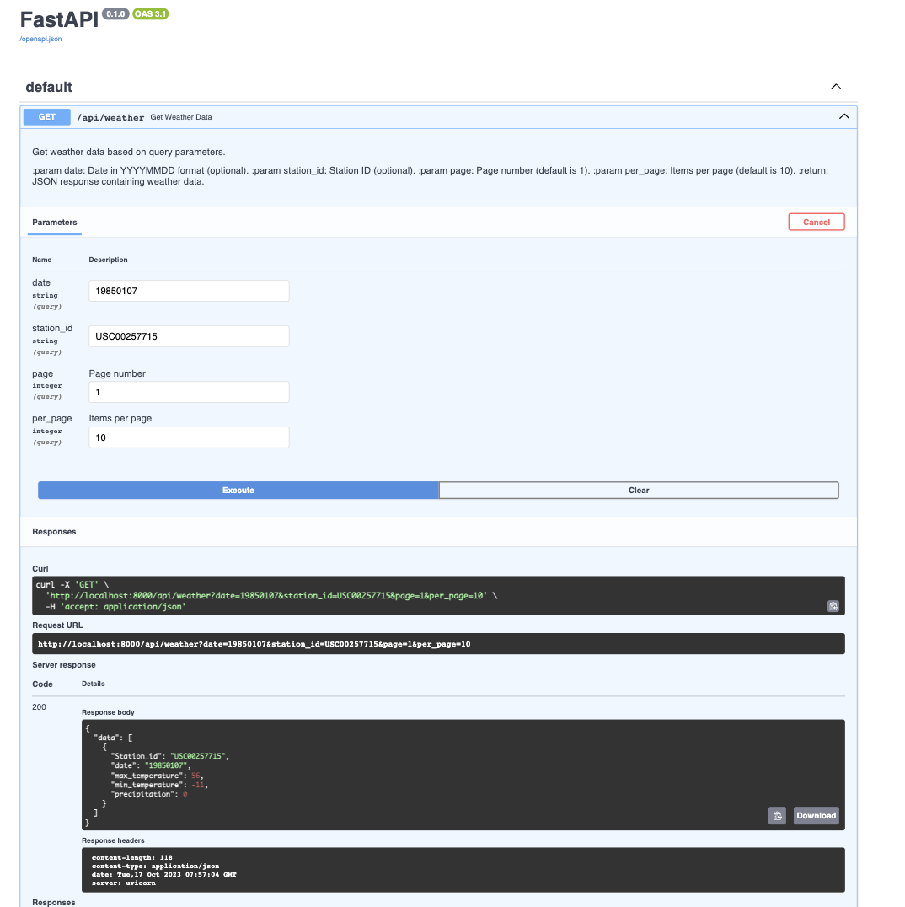
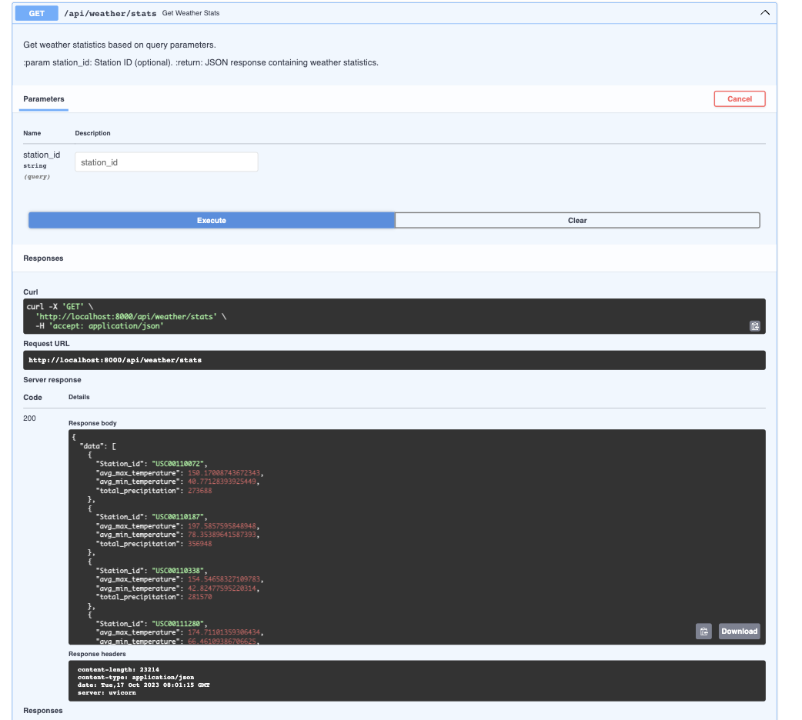

# Coding Challenge : Weather Stats

This is a Weather API based on FastAPI, designed to deliver weather information to users. It includes clear instructions on how to establish a virtual environment, install necessary dependencies, execute migrations, and ingest data. Furthermore, I have added guidance on accessing and utilizing the API.

The API comprises the following endpoints, each serving distinct purposes:

/api/weather: Allows users to retrieve weather data.
/api/weather/stats: Offers statistical insights into the available weather data.

# Installation

First we need to have python (3.7 and above).
Then we need to create a virtual environment.

```bash
# Install virtualenv
python3 -m pip install virtualenv

# Create a virtual environment
virtualenv venv

# Activate the virtual environment (Mac)
source venv/bin/activate

# Activate the virtual environment (Windows)
venv\Scripts\activate
```

We need to have necessary dependencies from requirements.txt using virtual environment.

```bash
pip3 install -r requirements.txt
```

The python3 database_manager.py generates a weather_data.db file.

```bash
python3 database_manager.py
```

Use the below command to run the FastAPI server on port 8000.

```bash
uvicorn api:app --host 0.0.0.0 --port 8000 --reload
```

## Endpoints

For /api/weather :

```bash
http://localhost:8000/docs#/default/get_weather_data_api_weather_get
```

For /api/weather/stats :

```bash
http://127.0.0.1:8000/docs#/default/get_weather_stats_api_weather_stats_get
```

# Testing

For testing purpose of the APIs, for the files, test_api.py, test_database_manager.py and test_api_helper.py use pytest command on terminal to check the results

```bash
pytest
```

# AWS Deployment

For deployment on AWS, I'll prefer to use below serives:

- ### Database:

    RDS (Relational Database Service): For hosting relational database with the support of PostgreSQL, MySQL, or other engines.

- ### API
    Elastic Beanstalk: for web application deployment particularly useful for web frameworks like Fast-Api, Flask or Django.

- ### Data Ingestion:
    AWS Lambda: Lambda function for the data ingestion process, with options to shedule those process.

- ### Static Data Storage:

    Amazon S3: like the weather data files, in Amazon S3 with the  service being  scalable, durable, and provides an efficient way to store and retrieve data.

- ### Swagger Documentation:
    Swagger documentation on an S3 bucket or use an API Gateway 

- ### API Gateway:
    Amazon API Gateway: To manage the REST API endpoints, and allows to create and publish APIs with ease.


## Output Screenshots




